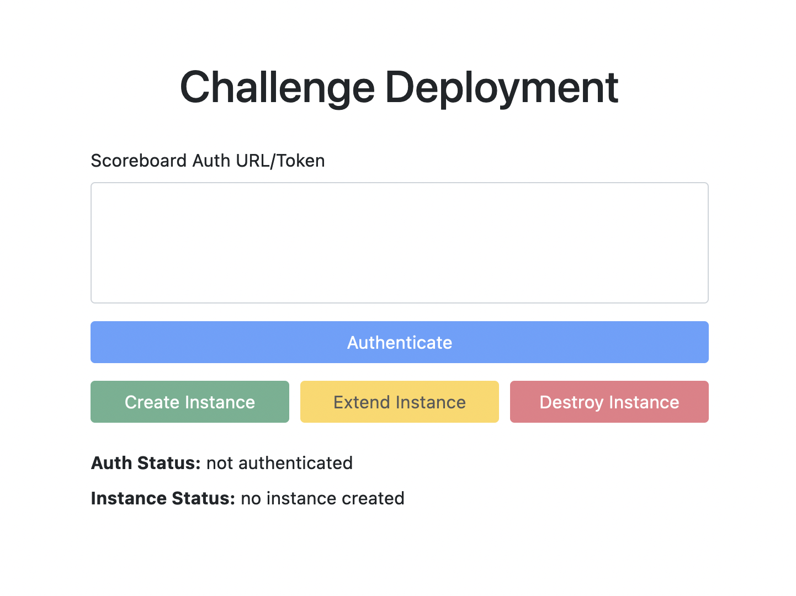

# chaldeploy

Web app to deploy a CTF challenge to k8s for single-team instance management



## Features

* Authenticate a team via rCTF, restricting each team to only a single deployment at a time
* Deploy a challenge to a Kubernetes cluster and provide the team with a service endpoint to interact with it
* Automatic challenge deletion after a timeout period
  * Teams can extend this if desired

## k8s deployment

TODO: set `CHALDEPLOY_SESSION_KEY`

```bash
# to do the initial deployment
kubectl apply -f deployment.yaml

# to expose service from minikube
minikube service chaldeploy --url

# to view service logs
kubectl logs -l app=chaldeploy -f

# to deploy a new service version
#   - bump version number in image tag in deployment.yaml
#   - and edit tag in below commands accordingly
export CHALDEP_VER=v1
docker build -t chaldeploy:$CHALDEP_VER . && minikube image load chaldeploy:$CHALDEP_VER
kubectl apply -f deployment.yaml
```

## target app

[src](https://gitlab.com/osusec/ctf-authors/damctf2020-chals/-/tree/master/test/test-nc)

```
docker build -t test-nc:v2
minikube image load test-nc:v2
kubectl apply -f target-app.yaml
```